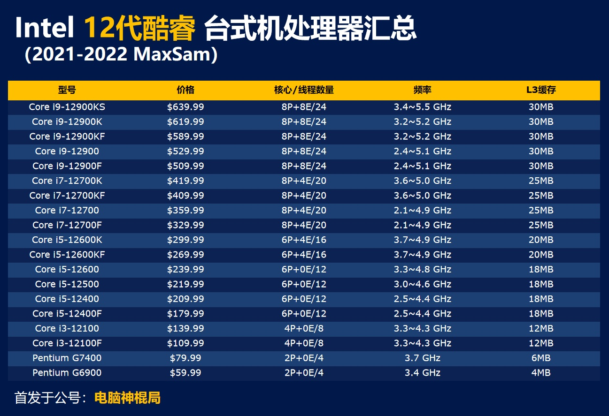
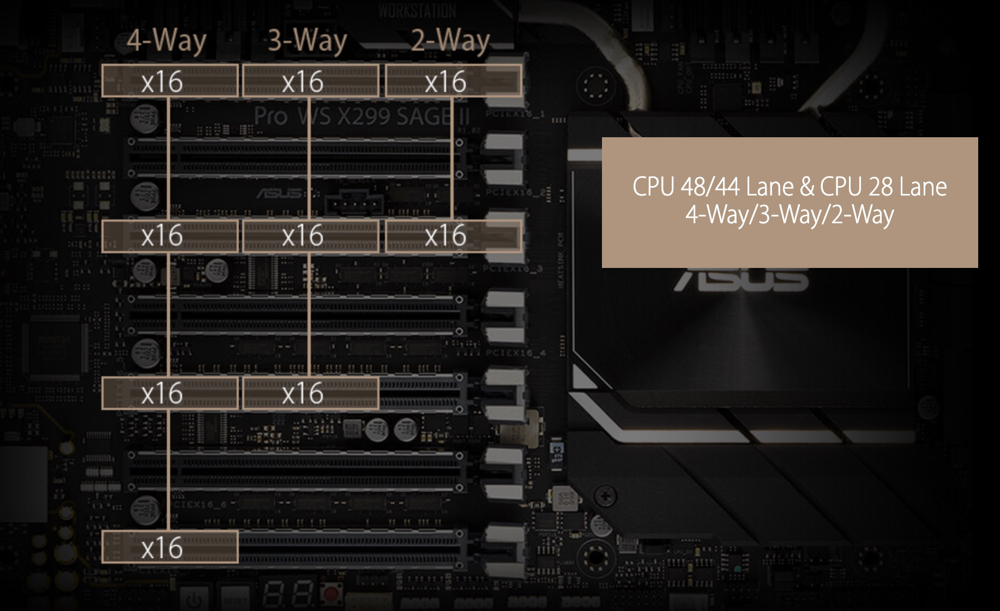
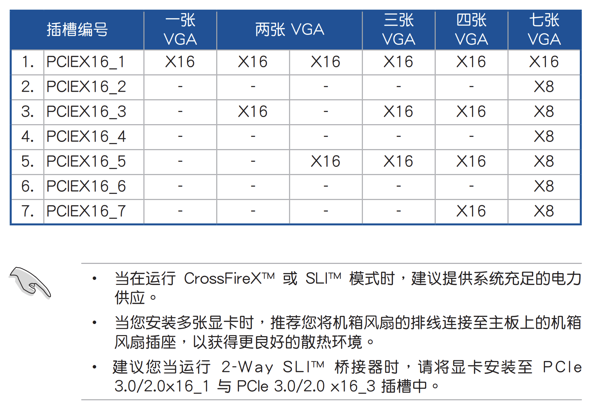
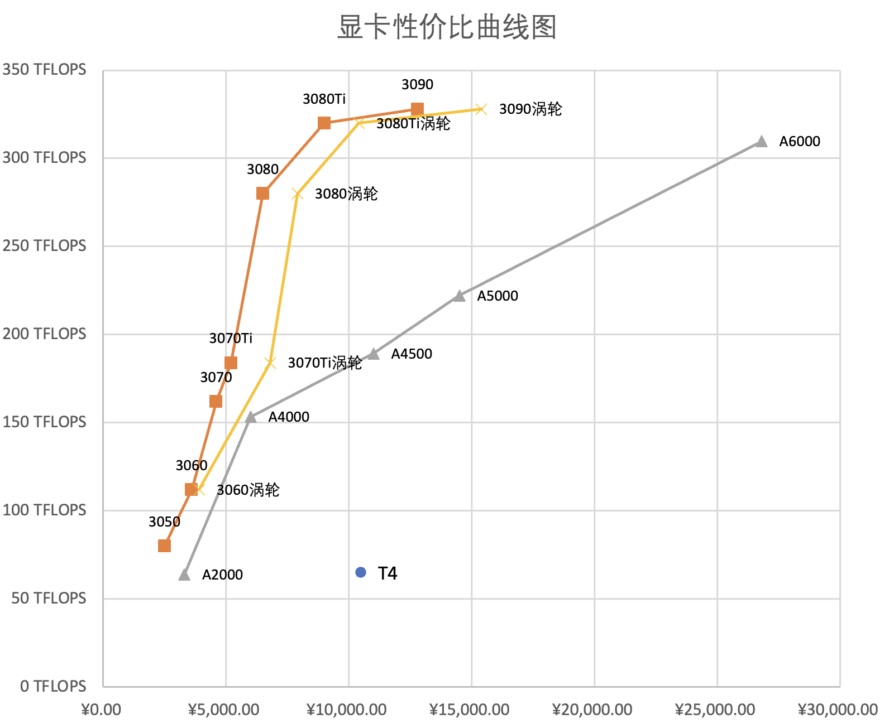
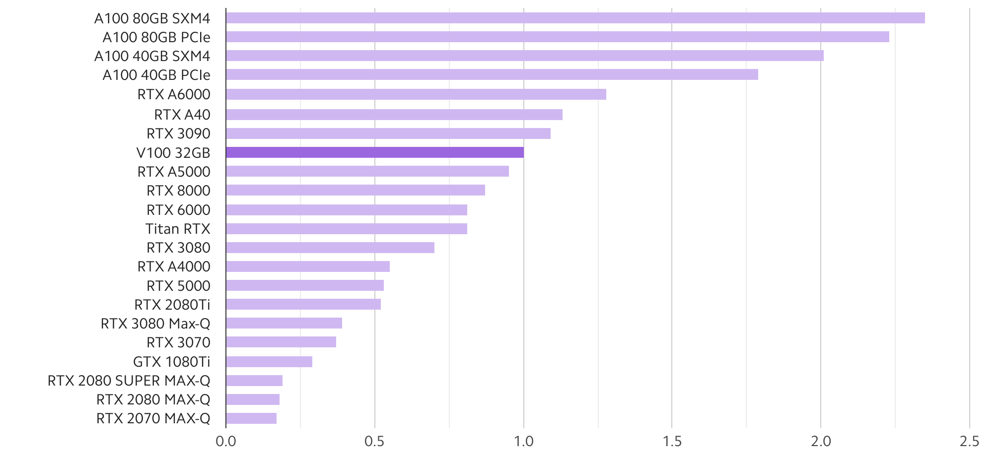

# 如何配置一台深度学习工作站?

这篇文章主要介绍的是家用的深度学习工作站，典型的配置有两种，分别是一个 GPU 的机器和 四个 GPU的机器。如果需要更多的 GPU 可以考虑配置两台四个 GPU 的机器。如果希望一台机器同时具备 8~10 个 GPU 需要联系[专门的供应商](https://www.supermicro.com/en/products/system/gpu/4u/sys-420gp-tnr)进行配置，并且需要专业的机房存放这些服务器，放在家里噪声很大并且容易跳闸。

## CPU

由于最近 AMD 和 Intel 频繁更新 CPU，因此大家选择新款的 CPU 比较好。

### CPU 与 GPU 的关系

CPU 瓶颈没有那么大，一般以一个 GPU 对应 2~4 个 CPU 核比较好，比如单卡机器买四核 CPU，四卡机器买十核 CPU。

当你在训练的时候，只要数据生成器（DataLoader）的产出速度比 GPU 的消耗速度快，那么 CPU 就不会成为瓶颈，也就不会拖慢训练速度。

### PCI-E 支持情况

除了核数，你还需要注意 PCI-E 支持情况，一般显卡是 PCI-E 4.0 x16，比如 [i9-10900X](https://www.intel.cn/content/www/cn/zh/products/sku/198019/intel-core-i910900x-xseries-processor-19-25m-cache-3-70-ghz/specifications.html) 的 PCI-E 通道数是 48 ，配置四卡的话，只能支持 1x16+3x8，也就是单卡全速，三卡半速。这种情况下可以考虑选择带有 PLX 桥接芯片的主板，比如 [Pro WS X299 SAGE II](https://www.asus.com.cn/Motherboards-Components/Motherboards/Workstation/Pro-WS-X299-SAGE-II/)。

### 英特尔CPU

英特尔 CPU 天梯图如下：

如果本文已经过时，你可以搜索关键字【CPU 天梯图】查找最新的 CPU 信息。

单卡根据预算选择合适的 CPU，双卡机器建议选 i9-10900 系列，四卡机器按照预算选  [X系列](https://www.intel.cn/content/www/cn/zh/products/details/processors/core/x.html) 的 CPU。（注意，X 系列最新发布的 CPU 是 2019 年的，已经不建议使用）

## 主板

主板需要注意：

* CPU 接口是否能对上，如 LGA1700 与 LGA206
* PCI-E 插槽的高度是否够插显卡，比如 PCI-E 插口之间的距离至少要满足**双槽宽显卡的高度**
* PCI-E 同时可以支持几张卡以什么样的速度运行，如 1x16 + 3x8 是常见的配置

### 主板必看参数

[GIGABYTE X299 AORUS MASTER \(rev. 1.0\)](https://www.gigabyte.cn/Motherboard/X299-AORUS-MASTER-rev-10) 使用了 4 组 2 槽间距显卡插槽设计，支持 1x16、2x16、2x16 + 1x8、1x16 + 3x8 四种配置（需要十核以上的 CPU），这里请参阅说明书安装显卡，安装在不同位置的速度是不一样的：

### 带有桥接芯片的主板

有的主板如 [Pro WS X299 SAGE II](https://www.asus.com.cn/Motherboards-Components/Motherboards/Workstation/Pro-WS-X299-SAGE-II/) 带有 PLX 桥接芯片，可以在 CPU 没有足够 PCI-E 的情况下达到四卡 x16 的速度：

在多卡并行训练的时候，PCI-E 的传输速度决定了梯度同步的速度，如果你训练的的模型比较大，希望搭建多卡机器，建议选择支持四路 PCI-E x16 的主板。

## 显卡

### 显卡性能表

| 型号       | 价格         | 显存    | 性能         | 厚度  |
| -------- | ---------- | ----- | ---------- | --- |
| 3090     | ¥12,799.00 | 24 GB | 328 TFLOPS | 3槽宽 |
| 3080Ti   | ¥8,999.00  | 12 GB | 320 TFLOPS | 3槽宽 |
| 3080     | ¥6,499.00  | 10 GB | 280 TFLOPS | 3槽宽 |
| 3070Ti   | ¥5,199.00  | 16 GB | 184 TFLOPS | 3槽宽 |
| 3070     | ¥4,599.00  | 8 GB  | 162 TFLOPS | 3槽宽 |
| 3060     | ¥3,599.00  | 12 GB | 112 TFLOPS | 3槽宽 |
| 3050     | ¥2,499.00  | 8 GB  | 80 TFLOPS  | 3槽宽 |
| 3090涡轮   | ¥15,399.00 | 24 GB | 328 TFLOPS | 2槽宽 |
| 3080Ti涡轮 | ¥10,399.00 | 12 GB | 320 TFLOPS | 2槽宽 |
| 3080涡轮   | ¥7,899.00  | 10 GB | 280 TFLOPS | 2槽宽 |
| 3070Ti涡轮 | ¥6,799.00  | 16 GB | 184 TFLOPS | 2槽宽 |
| 3060涡轮   | ¥3,899.00  | 12 GB | 112 TFLOPS | 2槽宽 |
| A2000    | ¥3,300.00  | 12 GB | 64 TFLOPS  | 1槽宽 |
| A4000    | ¥6,000.00  | 16 GB | 153 TFLOPS | 1槽宽 |
| A4500    | ¥11,000.00 | 20 GB | 189 TFLOPS | 2槽宽 |
| A5000    | ¥14,500.00 | 24 GB | 222 TFLOPS | 2槽宽 |
| A6000    | ¥26,800.00 | 48 GB | 310 TFLOPS | 2槽宽 |
| T4       | ¥10,500.00 | 16 GB | 65 TFLOPS  | 1槽宽 |

训练需要 FP32 和 FP16 的性能，推断需要 INT8 的性能。训练大模型需要注意显存大小。

考虑性价比可以买 RTX 3080Ti，想要大显存比可以买 RTX 3090。

值得注意的是，官方公布的参数并不一定是最终性能，实测 A6000 是比 3090 快的：

参考链接：

* [Ampere 架构白皮书](https://www.nvidia.com/content/PDF/nvidia-ampere-ga-102-gpu-architecture-whitepaper-v2.pdf)
* [Best GPU for Deep Learning in 2022 (so far)](https://lambdalabs.com/blog/best-gpu-2022-sofar/)

### 涡轮与风扇

采购显卡的时候，一定要注意买涡轮版的，不要买两个或者三个风扇的版本，除非你只打算买一张卡。

因为涡轮风扇的热是往外机箱外部吹的，所以可以很好地带走热量，散热比较好。如果买三个风扇的版本，插多卡的时候，上面的卡会把热量吹向第二张卡，导致第二张卡温度过高，影响性能。

风扇显卡很有可能是超过双槽宽的，第二张卡可能插不上第二个 PCI-E 插槽，这个也需要注意。

涡轮：[索泰 GeForce® RTX2080-8GD6 AI版 OC HA](https://www.zotac.com/cn/product/graphics_card/%E7%B4%A2%E6%B3%B0-geforce%C2%AE-rtx2080-8gd6-ai%E7%89%88-oc-ha)

风扇：[华硕 ROG 猛禽系列 GeForce RTX™ 2080 Ti OC版](https://rog.asus.com.cn/graphics-cards/graphics-cards/rog-strix/rog-strix-rtx2080ti-o11g-gaming-model/)

## 硬盘

### 硬盘类型

常用硬盘接口有三种：

* SATA3.0，速度 600MB/s
* SAS，速度 1200MB/s
* PCIE 3.0 x4（NVMe），速度 3.93GB/s
* PCIE 4.0 x4（NVMe），速度 7.87GB/s

### 参数对比

下面是根据代表产品查询的参数：

| 类型 | 价格\(元/TB\) | 读取速度\(MB/s\) | 写入速度 | 4K随机读取\(IOPS\) | 4K随机写入\(IOPS\) |
| :--- | :--- | :--- | :--- | :--- | :--- |
| SATA3 机械硬盘 | 150 | 270 | 258 | 170 | 550 |
| SATA3 固态硬盘 | 700 | 560 | 530 | 98000 | 88000 |
| NVMe 固态硬盘 | 800 | 3500 | 3000 | 500000 | 480000 |

注：

* SATA3 机械硬盘数据来源：[Seagate Exos X18 ST18000NM000J](https://www.seagate.com/files/www-content/datasheets/pdfs/exos-x18-channel-DS2045-1-2007CN-zh_CN.pdf)
* SATA3 固态硬盘数据来源：[870 QVO SATA 2.5英寸 固态硬盘](https://www.samsung.com/cn/memory-storage/sata-ssd/870-qvo-sata-3-2tb-mz-77q2t0b-cn/)
* NVMe 固态硬盘数据来源：[980 NVMe™ M.2 固态硬盘](https://www.samsung.com/cn/memory-storage/nvme-ssd/980-1tb-nvme-pcie-gen-3-mz-v8v1t0bw/)

在面对大量小文件的时候，使用 NVMe 硬盘可以一分钟扫完 1000万文件，如果使用普通硬盘，那么就需要一天时间。为了节省生命，简化代码，硬盘建议选择 NVMe 协议的固态硬盘。

如果你的主板不够新，没有 NVMe 插槽，你可以使用 M.2 转接卡将 M.2 接口转为 PCI-E 接口。

## 内存

内存容量的选择通常大于显存，比如单卡配 16GB 内存，四卡配 64GB 内存。由于有数据生成器（DataLoader），数据不必全部加载到内存里，通常不会成为瓶颈。

## 电源

先计算功率总和，如单卡 CPU 250W，显卡 350W，加上其他的大概 200W，那么就买 850W 的电源。

双卡最好买 1200W 以上的电源，四卡最好买 2000W 的电源。如果电源不够，跑起来所有的卡以后会因为电源不足而自动关机。

一般墙上的插座只支持 220V 10A，也就是 2200W 的交流电，由于电源要把交流电转直流电，所以会有一些损耗，最高只有 2000W，因此如果想要支持八卡，最好不要在家尝试。八卡一般是四个 PDU 电源，并且电流很大，所以需要专门走线，如果在家直接从墙上接插座，然后插四个电源，容易引发火灾。

## 网卡

一般主板自带千兆网卡。如果需要组建多机多卡集群，请联系供应商咨询专业的解决方案。

## 机箱

如果配单卡，可以直接买个普通中塔机箱，注意显卡长度能放下就行。

如果配四卡机器，建议买一个全塔机箱。

下图是我搭建四卡时使用的机箱，现在已经停产了。

## 显示器与键盘鼠标

深度学习工作站装好系统以后就不需要显示器和键鼠套装了，装系统的时候使用手边的显示器和键盘鼠标就行。

我们一般会在深度学习机器上安装 Linux 系统，然后通过 Mac 远程连接，通过 PyCharm 远程调试，所以主机只需要插电和插网线即可，不需要连接显示器和键盘鼠标。
